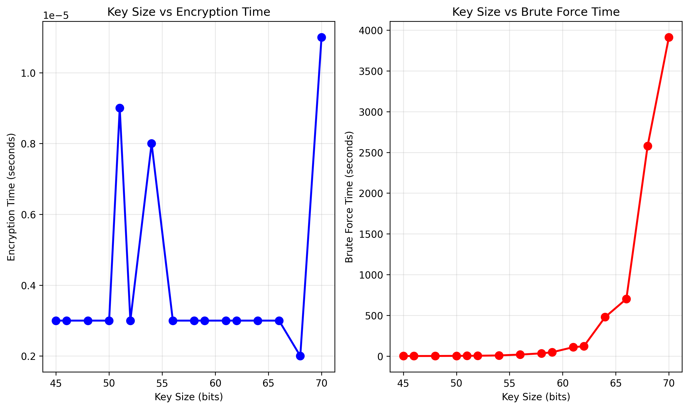

# RSA Brute Force Timing Analysis

This project demonstrates RSA encryption, decryption, and brute-force factorization timing analysis. It generates RSA key pairs of increasing size, encrypts a message, and measures the time required to brute-force the private key by factoring the modulus.

## Features

- RSA key generation, encryption, and decryption
- Brute-force factorization attack with timing
- Timing results exported to CSV
- Visualization of encryption and brute-force times

## Requirements

- Python 3.8+
- `matplotlib`

Install requirements:
```sh
pip install matplotlib
```

## Usage

To run the timing experiment and generate results:
```sh
python encryption_and_brute_force.py
```

This will generate:
- `rsa_timing_results.csv`: Timing data
- `rsa_timing_analysis.png`: Graphs of timing results

## Results

### Timing Graphs



### CSV Data

<details>
<summary>Click to expand CSV data</summary>

```csv
Key Size (bits),Encryption Time (s),Brute Force Time (s)
45,0.000003,0.368482
46,0.000003,0.444037
48,0.000003,0.891034
50,0.000003,2.171762
51,0.000009,3.174054
52,0.000003,3.806369
54,0.000008,7.592346
56,0.000003,18.029898
58,0.000003,33.305578
59,0.000003,46.421936
61,0.000003,109.026966
62,0.000003,120.596574
64,0.000003,478.385016
66,0.000003,701.437180
68,0.000002,2578.716575
70,0.000011,3913.295650
```
</details>
